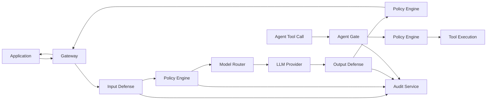

# AEGIS Architecture

## Overview

AEGIS is a provider-agnostic security gateway that protects LLM applications through five defense layers. Every decision fuses multiple independent signals; no single detector is the sole gate.

## Defense Layers

### 1. Input Defense (Python)

Intercepts and analyzes all user and retrieved content before it reaches the model.

| Detector | Signal Type | Purpose |
|----------|-------------|---------|
| Heuristic/regex | Deterministic | Known injection markers, encoding tricks |
| Perplexity | Statistical | Anomaly scoring vs reference LM |
| Known-answer probe | Game-theoretic | Secret token reproduction test |
| Transformer classifier | ML | Injection/jailbreak probability |
| Spotlighting transform | Structural | Delimit untrusted content |

**Output:** `InputVerdict` with fused score, per-detector breakdown, optional transformed content.

### 2. Policy Engine (Go + CEL)

Evaluates versioned YAML policy packs with CEL expressions against defense verdicts.

**Actions:** `allow`, `block`, `transform`, `escalate_to_judge`

**Modes:** enforce, shadow (log-only), dry-run

### 3. Output Defense (Python)

Analyzes model responses before they reach the application.

| Detector | Purpose |
|----------|---------|
| Toxicity/safety classifier | Harmful content |
| PII/secret detector | Credential leakage |
| Backtranslation consistency | Intent divergence detection |
| LLM-judge ensemble | Ambiguous case resolution (majority vote) |

### 4. Agent Gate (Go)

Deterministic, code-level permission system for tool/MCP calls — the LLM is never the security boundary.

- Per-tool, per-tenant permission matrix (least privilege)
- Information-flow taint tracking (RAG, web, tool outputs → untrusted)
- Human approval workflow for irreversible actions
- Credential masking in tool arguments

### 5. Red Team Engine (Python)

Continuous adversarial testing in sandboxed staging.

- Benchmark corpus loaders (HarmBench/AdvBench-style, locally provided)
- Mutation strategies (paraphrase, role-play, encoding, multi-turn)
- Nightly replay with ASR tracking per defense layer
- Rapid-response loop: successful attacks → proposed detector/policy patches

## Shared Schemas

All cross-service communication uses protobuf definitions in `shared/proto/aegis/v1/`:

| Message | Description |
|---------|-------------|
| `Request` | Unified gateway entry point |
| `InputVerdict` | Fused input defense result |
| `PolicyDecision` | CEL policy evaluation result |
| `OutputVerdict` | Fused output defense result |
| `ToolCallRequest` | Agent tool/MCP call |
| `AuditReceipt` | Ed25519-signed decision record |

JSON Schema mirrors live in `shared/jsonschema/v1/` for REST/OpenAPI.

## Data Stores

| Store | Usage |
|-------|-------|
| Postgres + pgvector | Audit logs (append-only), policy packs, attack pattern embeddings |
| Redis | Rate limiting, short-lived session state |

## Observability

- Structured JSON logging from all services
- OpenTelemetry tracing on the gateway hot path
- Audit receipts provide compliance-grade decision evidence

## Deployment

- **Local:** `docker-compose.yml` (all services + Postgres + Redis)
- **Production:** Helm chart in `deploy/helm/` (Stage 0: placeholder)

## Security Principles

1. **Defense-in-depth:** Fuse heuristic + statistical + ML + policy signals
2. **Deterministic action gating:** Tool permissions enforced in code, not by the model
3. **Taint tracking:** External content never silently becomes instruction
4. **Provider-agnostic:** No vendor logic outside `model-router`
5. **Tamper-evident audit:** Every decision signed with Ed25519
6. **Adaptive defense:** Red-team loop feeds new attacks back into detectors

## Residual Risk

See `THREAT_MODEL.md` (Stage 2+) for explicit limitations per layer.
