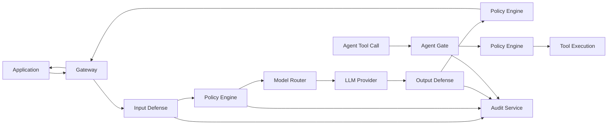

# AEGIS Architecture

## Overview

AEGIS is a provider-agnostic security gateway that protects LLM applications through five defense layers. Every decision fuses multiple independent signals; no single detector is the sole gate.

## Defense layers

### 1. Input Defense (Python) — Stage 2

Intercepts and analyzes all user and retrieved content before it reaches the model.

| Detector | Signal Type | Purpose |
|----------|-------------|---------|
| Heuristic/regex | Deterministic | Known injection markers, encoding tricks |
| Perplexity | Statistical | Anomaly scoring vs reference LM (stub) |
| Known-answer probe | Game-theoretic | Secret token reproduction test |
| Transformer classifier | ML | Injection/jailbreak probability (stub) |
| Spotlighting transform | Structural | Delimit untrusted content |

**Output:** `InputVerdict` with fused score, per-detector breakdown, optional transformed content.

**Port:** 8090 — see [input-defense/README.md](./input-defense/README.md)

### 2. Policy Engine (Go + CEL) — Stage 3

Evaluates versioned YAML policy packs with CEL expressions against defense verdicts.

**Actions:** `allow`, `block`, `transform`, `escalate_to_judge`

**Modes:** enforce, shadow (log-only), dry-run

**Port:** 8081 — see [policy-engine/README.md](./policy-engine/README.md)

### 3. Model Router (Go) — Stage 4

Provider-agnostic LLM routing with fallback, retry, and model-retired error surfacing.

**Port:** 8082 — see [model-router/README.md](./model-router/README.md)

### 4. Output Defense (Python) — Stage 5

Analyzes model responses before they reach the application.

| Detector | Purpose |
|----------|---------|
| Toxicity/safety classifier | Harmful content (stub backend) |
| PII/secret detector + redactor | Credential leakage detection and redaction |
| Backtranslation consistency | Intent divergence / incoherence (stub) |
| LLM-judge ensemble | Ambiguous case resolution — invoked only when fused score is in the ambiguous band |

**Output:** `OutputVerdict` with fused score, per-detector breakdown, optional `redacted_content`, optional `judge_votes`.

**Port:** 8091 — see [output-defense/README.md](./output-defense/README.md)

### 5. Agent Gate (Go) — Stage 6

Deterministic, code-level permission system for tool/MCP calls.

| Capability | Description |
|------------|-------------|
| Policy evaluation | Calls policy-engine `/v1/evaluate/tool` for CEL rules |
| Taint tracking | Propagates `taint_level` / `taint_source` on arguments |
| Credential masking | Regex-based detection + `[REDACTED-*]` in sanitized tool calls |
| Human approval | Irreversible actions → `AWAITING_HUMAN_APPROVAL` + `/v1/approvals/{id}/decide` |

**Port:** 8083 — see [agent-gate/README.md](./agent-gate/README.md)

### 6. Red Team Engine (Python) — Stage 7

Continuous adversarial testing in sandboxed staging.

| Capability | Description |
|------------|-------------|
| Attack corpus | Local YAML fixtures targeting input/output defenses |
| Mutation strategies | 8 transforms (paraphrase, roleplay, encoding, multi-turn, etc.) |
| Campaign runner | Probes defenses via HTTP; reports bypass rate by target/category |
| Pattern store | In-memory + optional Postgres `attack_patterns` for bypasses |

**Port:** 8092 — see [redteam/README.md](./redteam/README.md)

### 7. Audit Service (Go) — Stage 8

Tamper-evident, Ed25519-signed decision receipts persisted to Postgres.

| Capability | Description |
|------------|-------------|
| Receipt signing | SHA-256 canonical payload hash + Ed25519 signature |
| Persistence | Append-only `audit_receipts` table |
| Query / export | Filter by tenant, event type, time range; JSON/NDJSON export |
| Verification | `GET /v1/receipts/{id}/verify` recomputes hash and checks signature |

**Port:** 8084 — see [audit/README.md](./audit/README.md)

## Shared schemas

All cross-service communication uses protobuf definitions in `shared/proto/aegis/v1/`:

| Message | Description |
|---------|-------------|
| `Request` | Unified gateway entry point |
| `InputVerdict` | Fused input defense result |
| `PolicyDecision` | CEL policy evaluation result |
| `OutputVerdict` | Fused output defense result |
| `ToolCallRequest` | Agent tool/MCP call |
| `AuditReceipt` | Ed25519-signed decision record |

JSON Schema mirrors live in `shared/jsonschema/v1/` for REST/OpenAPI.

## Current wiring (Stages 0–8)

Services run independently via `docker-compose.yml`. Cross-service orchestration through the gateway is planned for later stages. Today:

- **Input defense → policy engine:** caller invokes `POST /analyze` then `POST /v1/evaluate/input`
- **Output defense → policy engine:** caller invokes `POST /analyze` then `POST /v1/evaluate/output`
- **Agent gate → policy engine:** caller invokes `POST /v1/evaluate` (gate calls policy-engine internally)
- **Red team → defenses:** `POST /v1/campaigns/run` probes input-defense and output-defense
- **Audit:** any layer can `POST /v1/receipts` to persist a signed decision receipt
- **Audit wiring:** input-defense, output-defense, policy-engine, and agent-gate emit receipts automatically when `AEGIS_AUDIT_URL` is set

See `scripts/e2e-output-defense.sh`, `scripts/e2e-agent-gate.sh`, `scripts/e2e-redteam.sh`, `scripts/e2e-audit.sh`, and `scripts/e2e-audit-pipeline.sh` for working examples.

## Data stores

| Store | Usage |
|-------|-------|
| Postgres + pgvector | Audit logs (append-only), policy packs, attack pattern embeddings |
| Redis | Rate limiting, short-lived session state |

## Observability

- Structured JSON logging from all services
- OpenTelemetry tracing on the gateway hot path (planned)
- Audit receipts provide compliance-grade decision evidence

## Deployment

- **Local:** `docker-compose.yml` (all services + Postgres + Redis)
- **Production:** Helm chart in `deploy/helm/` (placeholder)

## Security principles

1. **Defense-in-depth:** Fuse heuristic + statistical + ML + policy signals
2. **Deterministic action gating:** Tool permissions enforced in code, not by the model
3. **Taint tracking:** External content never silently becomes instruction
4. **Provider-agnostic:** No vendor logic outside `model-router`
5. **Tamper-evident audit:** Every decision signed with Ed25519
6. **Adaptive defense:** Red-team loop feeds new attacks back into detectors
7. **Loud model errors:** Retired/invalid LLM model IDs surface as explicit errors, not silent fallback

## Residual risk

Each service README documents known limitations and tracked gaps for its detectors. A formal threat model document is planned for a future stage.
