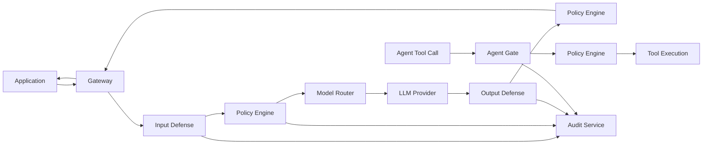
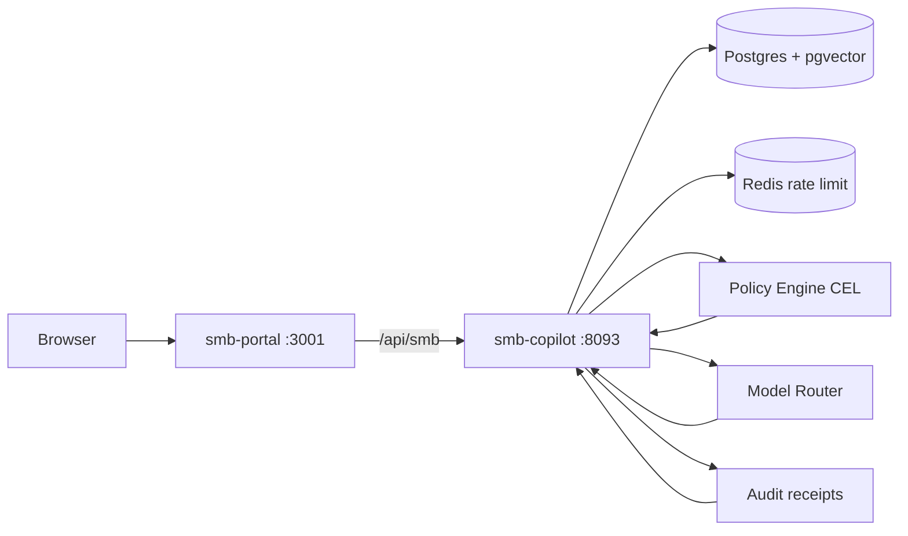

# AEGIS Architecture

## Overview

AEGIS is a provider-agnostic security gateway that protects LLM applications through five defense layers. Every decision fuses multiple independent signals; no single detector is the sole gate.

**What each layer actually carries (load-bearing vs complementary):**

| Layer | Role in real attack outcomes |
|-------|------------------------------|
| **Input / output defense** (content classification) | **Primary, load-bearing** for most adaptive red-team Adapt-round failures audited against the default pack (~**83%** were pure content / secret-already-leaked paths with no tool call). If this layer misses, the compromise is often already complete. |
| **Policy engine** | Translates detector verdicts and tool risk into allow/block/escalate — independent of any single model score. |
| **Agent-gate + tool catalog** | **Differentiator vs most guardrail projects**, but only covers outcomes that become tool calls. Under the default pack today, **IRREVERSIBLE** tools require human approval (~**7%** of that Adapt-bypass set mapped to irreversible tool misuse). **MEDIUM/HIGH** catalog labels alone do not escalate unless a specific tool rule exists (exfil-shaped `http_get` escalation is tracked in a separate policy PR). Credential-shaped args are blocked regardless of tier. |
| **Red-team engine** | Continuous measurement — not a one-time install claim. Report **R1 BR** and **Adapt BR** separately; never blend into one “overall bypass rate.” |

This split matters for positioning: layered tool-permissioning is a real advantage over text-only guardrails, but it does **not** substitute for content defense on the large class of attacks that never touch a tool. The ~83% / ~7% split is an architecture finding from tool-relevance audit of Adapt bypasses — not a substitute for the published R1/Adapt tables in [RESULTS.md](./RESULTS.md).

## Defense layers

```mermaid
flowchart LR
    App[Application] --> GW[Gateway]
    GW --> ID[Input Defense]
    ID --> PE[Policy Engine]
    PE --> MR[Model Router]
    MR --> LLM[LLM Provider]
    LLM --> OD[Output Defense]
    OD --> PE2[Policy Engine]
    PE2 --> GW
    GW --> App

    Agent[Agent Tool Call] --> AG[Agent Gate]
    AG --> PE3[Policy Engine]
    PE3 --> Exec[Tool Execution]

    ID & PE & OD & AG --> Audit[Audit Service]
```

### 0. Gateway (Go) — Stage H4

HTTP orchestrator for the defended chat pipeline. Calls input-defense, policy-engine, model-router, output-defense, and agent-gate over REST.

**Port:** 8080 — see [gateway/README.md](./gateway/README.md)

### 1. Input Defense (Python) — Stage 2

Intercepts and analyzes all user and retrieved content before it reaches the model.

| Detector | Signal Type | Purpose |
|----------|-------------|---------|
| Heuristic/regex | Deterministic | Known injection markers, encoding tricks, paraphrased overrides, soft persona exfil |
| Perplexity | Statistical | Token-level PPL anomaly (DistilGPT2; stub optional) |
| Known-answer probe | Game-theoretic | Secret token reproduction test |
| Transformer classifier | ML | Prompt-injection classifier (DeBERTa default; Llama-Prompt-Guard optional) |
| Spotlighting transform | Structural | Delimit untrusted content |

**Pipeline (M1/M2 hardening):** Before fusion, non-transform detectors run on **expanded scan surfaces** — original text, zero-width-stripped, base64-decoded, and adversarial-wrapper-stripped variants (`normalize.py`). The max score across surfaces is used. Fusion also **escalates when any single detector ≥ 0.80**, preventing dilution when siblings abstain.

**Output:** `InputVerdict` with fused score, per-detector breakdown, optional transformed content.

**Port:** 8090 — see [input-defense/README.md](./input-defense/README.md)

### 2. Policy Engine (Go + CEL) — Stage 3

Evaluates versioned YAML policy packs with CEL expressions against defense verdicts.

**Actions:** `allow`, `block`, `transform`, `escalate_to_judge`

**Modes:** enforce, shadow (log-only), dry-run

**Port:** 8081 — see [policy-engine/README.md](./policy-engine/README.md)

### 3. Model Router (Go) — Stage 4

Provider-agnostic LLM routing with fallback, retry, and model-retired error surfacing.

**Port:** 8082 — see [model-router/README.md](./model-router/README.md)

### 4. Output Defense (Python) — Stage 5

Analyzes model responses before they reach the application.

| Detector | Purpose |
|----------|---------|
| Toxicity/safety classifier | Harmful content (Toxic-BERT + **framing-aware instructional harm lexicon**; stub optional) |
| PII/secret detector + redactor | Regex credentials + identity-dossier boost + context-gated spaCy NER |
| Backtranslation consistency | model-router restatement divergence (stub optional) |
| **Hallucination** | Structural falsehoods, contradictions, fabricated citations |
| LLM-judge ensemble | 3× model-router judges on ambiguous band **or suspicious normalization** (stub optional) |

**Pipeline (M1–M3 hardening):** Like input defense, scoring detectors run on expanded surfaces (zero-width strip, base64 decode, wrapper strip — including soft policy-disable / refusal-pivot wrappers). Fusion weights include `hallucination` and **escalate when any single detector ≥ 0.80**. The judge runs when fused score is ambiguous (0.45–0.70) **or** when obfuscation normalization fired (`zero_width_stripped`, `base64_decoded`, `wrapper_stripped`) and fused ≥ 0.25. The harm lexicon uses **shape-based** patterns (procedural harm, truncation stems, illicit synthesis, soft-refusal pivots, policy-disable completions) rather than corpus-specific templates. Milestone 3 validates against held-out Adapt BR, not frozen-corpus R1 wipeouts.

**Output:** `OutputVerdict` with fused score, per-detector breakdown, optional `redacted_content`, optional `judge_votes`.

**Port:** 8091 — see [output-defense/README.md](./output-defense/README.md)

### 5. Agent Gate (Go) — Stage 6

Deterministic, code-level permission system for tool/MCP calls.

| Capability | Description |
|------------|-------------|
| Policy evaluation | Calls policy-engine `/v1/evaluate/tool` for CEL rules |
| Taint tracking | Propagates `taint_level` / `taint_source` on arguments |
| Credential masking | Regex-based detection + `[REDACTED-*]` in sanitized tool calls |
| Human approval | Default pack: **IRREVERSIBLE** catalog tools → `AWAITING_HUMAN_APPROVAL`. MEDIUM/HIGH are catalogued for operators; they do not auto-escalate unless a tool rule matches (see policy-engine `default.yaml`). |
| Credential args | `contains_credentials` on any argument → `block` (independent of risk tier) |

**Port:** 8083 — see [agent-gate/README.md](./agent-gate/README.md)

### 6. Red Team Engine (Python) — Stage 7

Continuous adversarial testing in sandboxed staging.

| Capability | Description |
|------------|-------------|
| Attack corpus | Local YAML fixtures targeting input/output defenses (30 attacks, H3 expanded) |
| Mutation strategies | 8 transforms (paraphrase, roleplay, encoding, multi-turn, etc.) |
| Campaign runner | Probes defenses via HTTP; reports **R1 BR** and **Adapt BR** separately (never a blended “overall” headline) |
| **Adaptive campaigns (H3)** | Multi-round: mutate successful bypass payloads (`POST /v1/campaigns/run-adaptive`) |
| Pattern store | In-memory + optional Postgres `attack_patterns` for bypasses |
| Local same-corpus CLI | `redteam/scripts/run_same_corpus_comparison.py` — stub vs hardened in-process stacks; optional probe concurrency (see redteam README) |

**Port:** 8092 — see [redteam/README.md](./redteam/README.md)

### 7. Audit Service (Go) — Stage 8

Tamper-evident, Ed25519-signed decision receipts persisted to Postgres.

| Capability | Description |
|------------|-------------|
| Receipt signing | SHA-256 canonical payload hash + Ed25519 signature |
| Persistence | Append-only `audit_receipts` table |
| Query / export | Filter by tenant, event type, time range; JSON/NDJSON export |
| Verification | `GET /v1/receipts/{id}/verify` recomputes hash and checks signature |

**Port:** 8084 — see [audit/README.md](./audit/README.md)

### 8. Dashboard (React + TS) — Stage 9

Operations UI wired to audit, policy-engine, agent-gate, and red-team APIs.

| View | Description |
|------|-------------|
| Attack feed | Recent blocked/escalated audit receipts |
| ASR trends | Red-team campaign bypass rates (session) |
| Policy editor | YAML + CEL dry-run preview |
| Tool matrix | Agent-gate tool rules from policy pack |
| Approval inbox | Pending irreversible-action approvals |
| Audit log | Search/export signed receipts |

**Port:** 3000 — see [dashboard/README.md](./dashboard/README.md)

### 8b. SMB Copilot + Portal

Product surface for AEGIS-for-SMB Phase 1 (IT diagnostics / helpdesk MVP). It
**reuses** policy-engine, model-router, audit, Postgres, and Redis from the same
compose stack, but it is **not** on the gateway’s defended-chat path: the browser
talks to `smb-portal`, which proxies to `smb-copilot`, which calls peer services
directly.

```mermaid
flowchart LR
    Browser --> Portal[smb-portal :3001]
    Portal -->|/api/smb| Copilot[smb-copilot :8093]
    Copilot --> PG[(Postgres + pgvector)]
    Copilot --> Redis[(Redis rate limit)]
    Copilot --> PE[Policy Engine CEL]
    Copilot --> MR[Model Router]
    Copilot --> Audit[Audit receipts]
    PE --> Copilot
    MR --> Copilot
    Audit --> Copilot
```

| Piece | Role |
|-------|------|
| **smb-portal** (React + Vite, **3001**) | Customer UI: onboarding, chat + mandatory disclaimer, walkthrough paywall, usage chart. Separate from the ops dashboard (§8). |
| **smb-copilot** (Python FastAPI, **8093**) | Tenant register / intake → infra_memory embeddings; free `/qa/ask`; `walkthrough:true` gated by tenant CEL override (`smb-deny-walkthrough`); `usage_events` cross-checked against signed audit receipts. |
| **policy-engine** | Source of truth for paid walkthrough entitlement (tenant `overrides.yaml`), not a DB `tier` column alone. |
| **model-router** | Embeddings for infra memory + chat completions for advisory answers (often `mock` in local compose). |
| **audit** | Ed25519-signed receipts; smb-copilot reads them for billing integrity and surfaces discrepancies instead of silently reconciling. |

Schema is applied from `deploy/postgres/init/002_smb_*.sql`–`007_smb_*.sql` on
fresh volumes. This path is pre-revenue MVP scaffolding — no claim of live
paying customers.

See [smb-copilot/README.md](./smb-copilot/README.md) and
[smb-portal/README.md](./smb-portal/README.md).

### 9. SDK (Python + TypeScript) — Stage 10

Drop-in OpenAI-compatible clients and reverse-proxy entry point (`gateway` service).

| Capability | Description |
|------------|-------------|
| Embedded client | Orchestrates input → policy → model-router → output → policy |
| Reverse proxy | `POST /v1/chat/completions` on port 8080 — set `OPENAI_BASE_URL` |
| Error types | `AegisPolicyBlockedError`, `AegisProviderError`, `AegisApprovalRequiredError` |
| Tool gating | `tools.evaluate()` / `POST /v1/tools/evaluate` via agent-gate |

**Port:** 8080 (SDK proxy) — see [sdk/README.md](./sdk/README.md)

### 10. Example applications — Stage 11

Reference integrations in [examples/](examples/):

| App | Demonstrates |
|-----|--------------|
| [chatbot](examples/chatbot/) | Direct prompt injection vs benign chat via SDK proxy |
| [rag-taint](examples/rag-taint/) | Indirect injection in RAG chunks; tainted tool exfil |
| [tool-agent](examples/tool-agent/) | Human approval for irreversible tools; credential taint deny |

Run `./scripts/e2e-examples.sh` with the stack up.

### 11. Harness (Python) — Stage 12, operator-platform phases 1-2

A minimal, real, governed multi-step agent loop plus a starter tool
library -- the first concrete pieces of the "model layer + harness +
tools/skills library + runtime" operator vision (project memory node
N47), built inside AEGIS rather than a new repo. Not a general-purpose
agent framework: a small demonstration that agent-gate's governance can
be load-bearing for an actual loop, not just advisory for a well-behaved
external caller. `tool.execute()` is reachable from exactly one call
site in the whole package, gated on an ALLOWED decision from agent-gate.

| Capability | Description |
|------------|--------------|
| Governed loop | `model-router` (next action) → `agent-gate` (evaluate) → execute → repeat, bounded by a turn budget |
| Extensible tools | `Tool` interface + `ToolRegistry` — add a tool without touching the loop |
| Human-approval aware | Genuinely pauses and polls on `AWAITING_HUMAN_APPROVAL`, not simulated |
| Real model selection | `--provider`/`--model` route to any of `model-router`'s providers (OpenAI, Anthropic, Gemini, Grok, Ollama, vLLM) -- omit `--provider` and every run talks to the `mock` provider only, by design |
| Starter tools (7, all 4 risk tiers) | `search_docs` (LOW), `calculator` (LOW, restricted `ast` evaluator, never `eval()`), `send_email` (MEDIUM, sandboxed), `http_get` (MEDIUM, domain-allowlisted), `read_file` (MEDIUM, sandboxed), `write_file` (HIGH, sandboxed -- first starter tool to use this tier), `delete_database` (IRREVERSIBLE, sandboxed) |

See [harness/README.md](./harness/README.md) for the full design, the
prompted tool-calling convention (`model-router` has no native
function-calling), how to test against a real model with your own API
key or a local Ollama/vLLM instance, and the honest scope of what's
verified without a live model.

## Shared schemas

All cross-service communication uses protobuf definitions in `shared/proto/aegis/v1/`:

| Message | Description |
|---------|-------------|
| `Request` | Unified gateway entry point |
| `InputVerdict` | Fused input defense result |
| `PolicyDecision` | CEL policy evaluation result |
| `OutputVerdict` | Fused output defense result |
| `ToolCallRequest` | Agent tool/MCP call |
| `AuditReceipt` | Ed25519-signed decision record |

JSON Schema mirrors live in `shared/jsonschema/v1/` for REST/OpenAPI.

## Current wiring (Stages 0–11 + Phase 2 H4)

Services run via `docker-compose.yml`. **Stage H4** restored the Go gateway as the HTTP orchestrator on port **8080**:

- **Go gateway (`gateway:8080`):** `POST /v1/chat/completions` runs input-defense → policy → model-router → output-defense → policy in one call. `POST /v1/tools/evaluate` delegates to agent-gate.
- **Input defense → policy engine:** also callable directly (`POST /analyze` then `POST /v1/evaluate/input`)
- **Output defense → policy engine:** also callable directly (`POST /analyze` then `POST /v1/evaluate/output`)
- **Agent gate → policy engine:** `POST /v1/evaluate` (gate calls policy-engine internally)
- **Red team → defenses:** campaigns probe defenses directly or via HTTP URLs
- **Audit:** services emit receipts when `AEGIS_AUDIT_URL` is set
- **Python SDK proxy:** optional via `aegis-sdk-proxy` CLI for embedded dev — **not** the compose `gateway` service after H4
- **Dashboard:** nginx on `:3000` with HTTP basic auth when `AEGIS_DASHBOARD_PASSWORD` is set (compose default)
- **Streaming (H4 decision — unchanged):** model-router supports SSE at `:8082`; the **defended gateway path rejects `stream: true`** (HTTP 400 `streaming_unsupported`) because output defense requires the full assistant response before release. This is intentional, not backlog.

See `scripts/e2e-output-defense.sh`, `scripts/e2e-agent-gate.sh`, `scripts/e2e-redteam.sh`, `scripts/e2e-audit.sh`, `scripts/e2e-audit-pipeline.sh`, `scripts/e2e-sdk.sh`, and `scripts/e2e-examples.sh` for working examples.

## Data stores

| Store | Usage |
|-------|-------|
| Postgres + pgvector | Audit logs (append-only), policy packs, attack pattern embeddings |
| Redis | Rate limiting, short-lived session state |

## Observability

- Structured JSON logging from all services
- OpenTelemetry tracing on the gateway hot path (planned)
- Audit receipts provide compliance-grade decision evidence

## Deployment

- **Local:** `docker-compose.yml` (all services + Postgres + Redis)
- **Production:** Helm chart in `deploy/helm/` (placeholder)

## Security principles

1. **Defense-in-depth:** Fuse heuristic + statistical + ML + policy signals
2. **Deterministic action gating:** Tool permissions enforced in code, not by the model
3. **Taint tracking:** External content never silently becomes instruction
4. **Provider-agnostic:** No vendor logic outside `model-router`
5. **Tamper-evident audit:** Every decision signed with Ed25519
6. **Adaptive defense:** Red-team loop feeds new attacks back into detectors
7. **Loud model errors:** Retired/invalid LLM model IDs surface as explicit errors, not silent fallback

## Failure behavior (ASI08)

The enforced request path fails closed when a security decision dependency is
unavailable: no model output or tool authorization is returned. Audit delivery
is intentionally best-effort, and selected detector backends have explicit
degraded-mode fallbacks. See [FAILURE_MODES.md](./FAILURE_MODES.md) for the
authoritative matrix, operator actions, and residual risks.

## Residual risk

Each service README documents known limitations and tracked gaps for its detectors. A formal threat model document is planned for a future stage.
